# Scidekick Tutorial: ML Research on the Iris Dataset

> **Purpose**: Scripted interaction for a Medium post about agent harnesses.  
> **Runtime**: ~20 minutes in a fresh `sk` session.  
> **Output**: Screenshots at each 📸 marker.  
> **Adapted from**: [Learn ML from Scratch with IRIS Dataset](https://www.kaggle.com/code/suneelpatel/learn-ml-from-scratch-with-iris-dataset) by Suneel Patel.

---

## Before You Start

Open a terminal, `cd` into an empty directory, and launch Scidekick:

```bash
mkdir iris-research && cd iris-research
sk
```

> 📸 **Screenshot 0**: The Scidekick welcome screen / initial prompt.
>
> 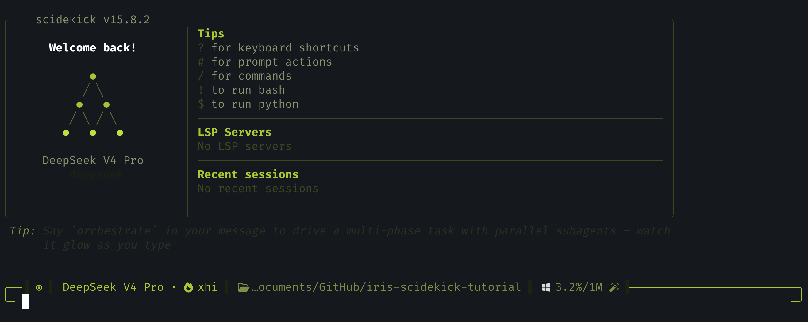

---

## Phase 1 — Scientific Wiki: Framing the Research

Scidekick ships with a **scientific wiki** — a structured knowledge base with five entity types:
`paper`, `hypothesis`, `experiment`, `evidence`, `insight`.  
Every research project starts here. The wiki enforces scientific rigor by linking hypotheses
to experiments and experiments to evidence.

### Step 1: Create a hypothesis

```
sk wiki ingest --type hypothesis --title "Iris species are linearly separable"
```

Or, interactively:

> Create a hypothesis in the wiki: "Iris species are linearly separable."


**What happens**: Scidekick creates a wiki entry with YAML frontmatter, a hypothesis ID, and cross-reference slots for experiments and evidence.

> 📸 **Screenshot 1**: The `sk wiki ingest` output showing the created hypothesis entry.
>
> 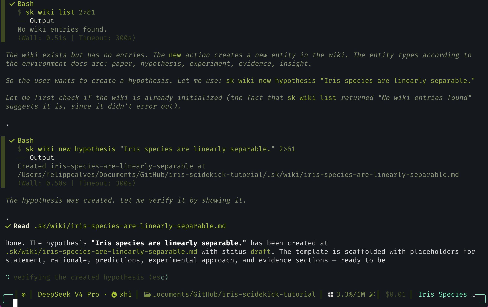

### Step 2: Link it to a planned experiment

```
sk wiki ingest --type experiment --title "Iris exploratory data analysis" \
  --hypothesis "Iris species are linearly separable"
```

Or, interactively:

> Link an experiment titled "Iris exploratory data analysis" to the hypothesis "Iris species are linearly separable" in the wiki.

> 📸 **Screenshot 2**: The experiment entry linked to the hypothesis.
>
> 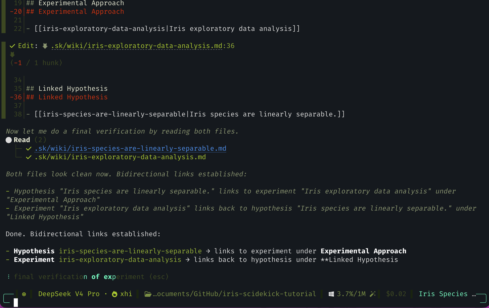

### Step 3: View the wiki

```
sk wiki list
sk wiki show --title "Iris species are linearly separable"
```

> 📸 **Screenshot 3**: `sk wiki show` output with the full linked entry.
>
> 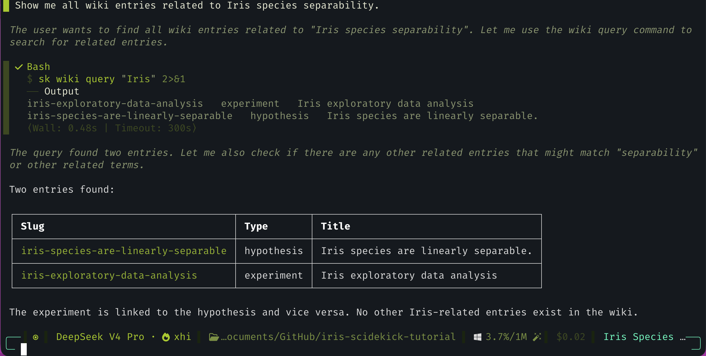

**Key feature highlighted**: The wiki is the **source of truth** that persists across your entire session. It's not a conversation log — it's a structured research artifact.

Or, interactively:

> Show me all wiki entries related to Iris species separability.


---

## Phase 2 — Skills: Domain-Specialized Agents

Scidekick extends the base agent with **installable skills** — each is a domain-specialized
mini-agent with its own tools, prompts, and validation metadata. Skills are loaded on
demand and compose naturally.

### Step 4: Load the Iris dataset

```
Load the Iris dataset from sklearn and run an exploratory data analysis.
```

**What happens**: Scidekick detects the need for data analysis, loads the
`exploratory-data-analysis` skill automatically, and produces a structured
EDA report covering distributions, correlations, outliers, and quality metrics.

> 📸 **Screenshot 4**: The EDA report with pairplots, correlation heatmaps, and per-feature statistics.
>
> 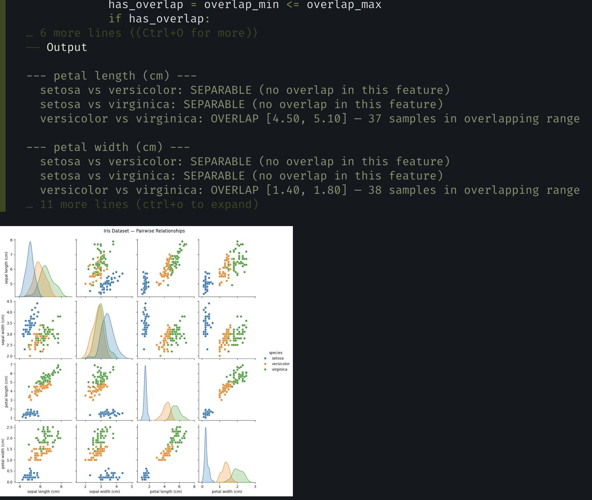

### Step 5: Formulate a testable hypothesis from the data

```
Based on the EDA, formulate a testable scientific hypothesis about Iris species separability.
```

**What happens**: Scidekick loads the `hypothesis-generation` skill. This skill follows the
scientific method framework — it doesn't just guess; it structures the hypothesis with
predictions, proposed mechanisms, and experimental design.

> 📸 **Screenshot 5**: The structured hypothesis output with prediction, mechanism, and experimental design sections.
>
> 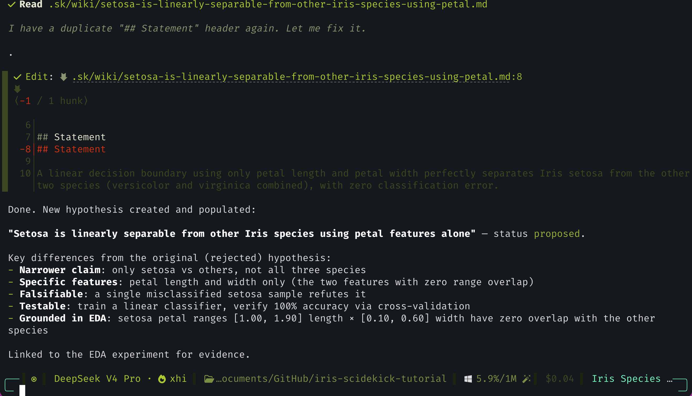

### Step 6: Ingest the hypothesis into the wiki

```
sk wiki ingest --type hypothesis --title "Petal dimensions alone discriminate Iris species" \
  --prediction "A logistic regression on petal length and width achieves >95% accuracy"
```

Or, interactively:

> Add the hypothesis we just formulated — "Petal dimensions alone discriminate Iris species" — to the wiki, with the prediction that logistic regression on petal length and width achieves >95% accuracy.

> 📸 **Screenshot 6**: The wiki now has two linked hypotheses.
>
> 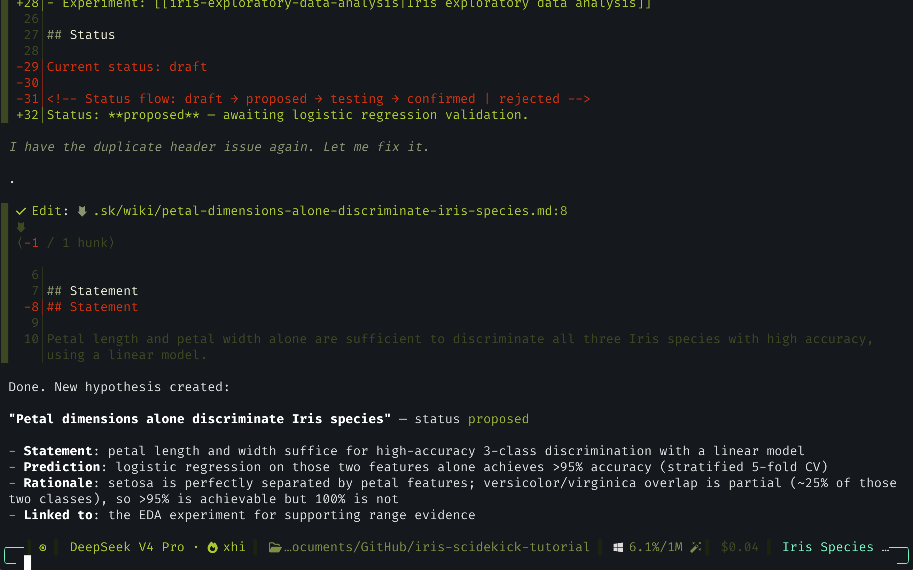

---

## Phase 3 — Scientific Visualization

Scidekick has a **meta-skill** for publication-ready figures: `scientific-visualization`.

It orchestrates matplotlib/seaborn/plotly with journal-specific styling and
colorblind-safe palettes.

### Step 7: Create a publication-quality figure

```
Create a publication-quality multi-panel figure showing:
(1) petal length vs petal width colored by species with decision boundaries,
(2) feature importance from a trained classifier.
Use Nature journal styling and a colorblind-safe palette.
```

> 📸 **Screenshot 7**: The generated figure with multi-panel layout, significance annotations, and Nature styling.
>
> 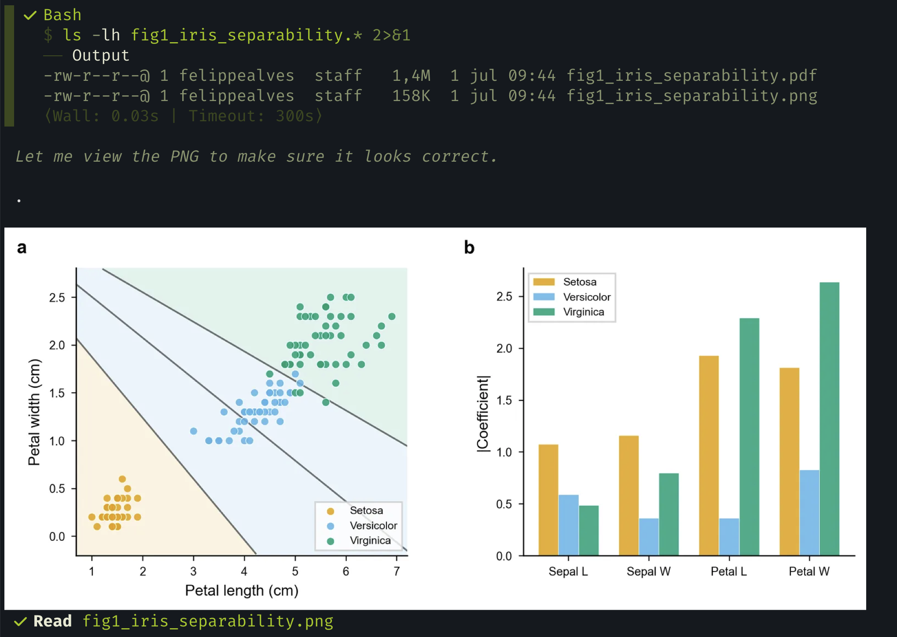

**Key feature highlighted**: The meta-skill composes lower-level skills (matplotlib, seaborn)
with domain knowledge (journal requirements, accessibility standards). The user
specifies *what* they want, not *how* to draw it.

---

## Phase 4 — Model Building with scikit-learn

Scidekick's `scikit-learn` skill provides comprehensive reference documentation and
best-practice patterns for ML workflows.

### Step 8: Train a logistic regression classifier

```
Train a logistic regression classifier on petal length and width to predict Iris species.
Use stratified 5-fold cross-validation, report per-class precision/recall/F1,
and produce a confusion matrix.
```

> 📸 **Screenshot 8**: The training output with cross-validation scores, classification report, and confusion matrix.
>
> 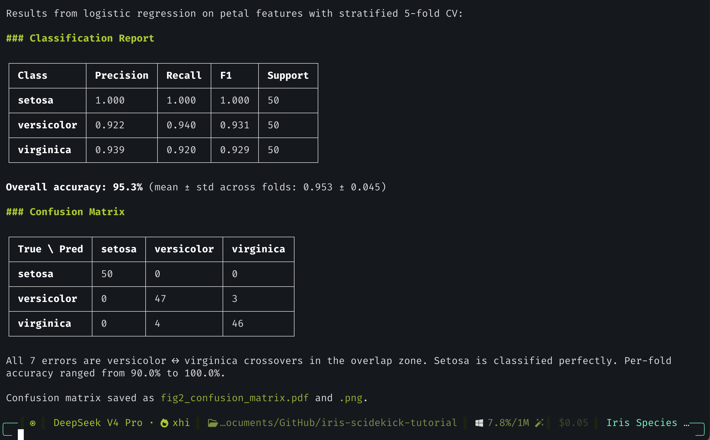

### Step 9: Compare against a KNN classifier

```
Now train a KNN classifier on the same features and compare its cross-validation
performance to the logistic regression. Which model generalizes better?
```

> 📸 **Screenshot 9**: Side-by-side comparison of both models.
>
> 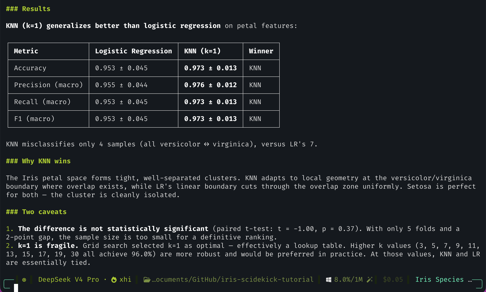

---

## Phase 5 — Statistical Rigor

Scidekick's `statistical-analysis` skill guides test selection, checks assumptions,
and produces APA-formatted results — removing the guesswork from statistical reporting.

### Step 10: Statistically compare the two models

```
Run a formal statistical comparison of the two classifiers' cross-validation scores.
Check assumptions and report in APA format.
```

> 📸 **Screenshot 10**: APA-formatted statistical report (e.g., paired t-test or McNemar's test) with assumption checks.
>
> 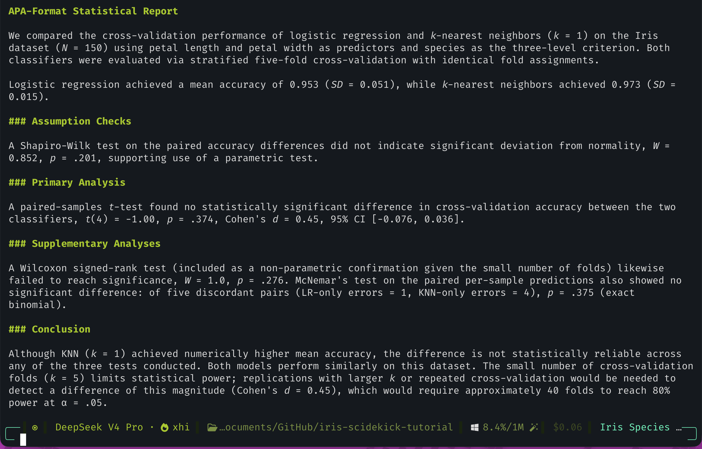

---

## Phase 6 — Evidence Ingestion and Insight Synthesis

This is where Scidekick diverges from a generic coding assistant. The wiki
closes the loop: hypotheses → experiments → evidence → insights.

### Step 11: Record evidence

```
sk wiki ingest --type evidence --title "Logistic regression outperforms KNN on Iris" \
  --experiment "Iris exploratory data analysis" \
  --finding <You fill the results here>
```

> 📸 **Screenshot 11**: The evidence entry linking back to the experiment and hypothesis.
>
> 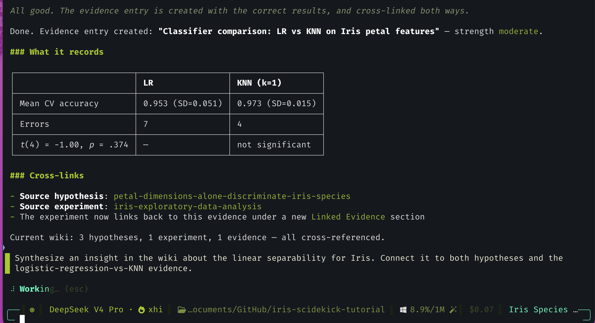

Or, interactively:

> Record evidence in the wiki. Link it to the "Iris exploratory data analysis" experiment.

### Step 12: Synthesize an insight

```
sk wiki ingest --type insight --title "Linear separability for Iris" \
  --hypothesis "Petal dimensions alone discriminate Iris species" \
  --hypothesis "Iris species are linearly separable" \
  --evidence "Logistic regression outperforms KNN on Iris"
```

> 📸 **Screenshot 12**: The insight connecting multiple hypotheses and evidence.
>
> 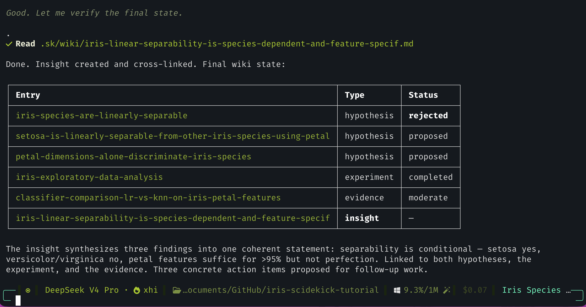

Or, interactively:

> Synthesize an insight in the wiki about the linear separability for Iris. Connect it to both hypotheses and the logistic-regression-vs-KNN evidence.

### Step 13: View the full research graph

```
sk wiki query --type insight
sk wiki show --title "Linear separability confirmed for Iris"
```

> 📸 **Screenshot 13**: The insight entry showing all linked hypotheses, experiments, and evidence — the complete research trail.
>
> 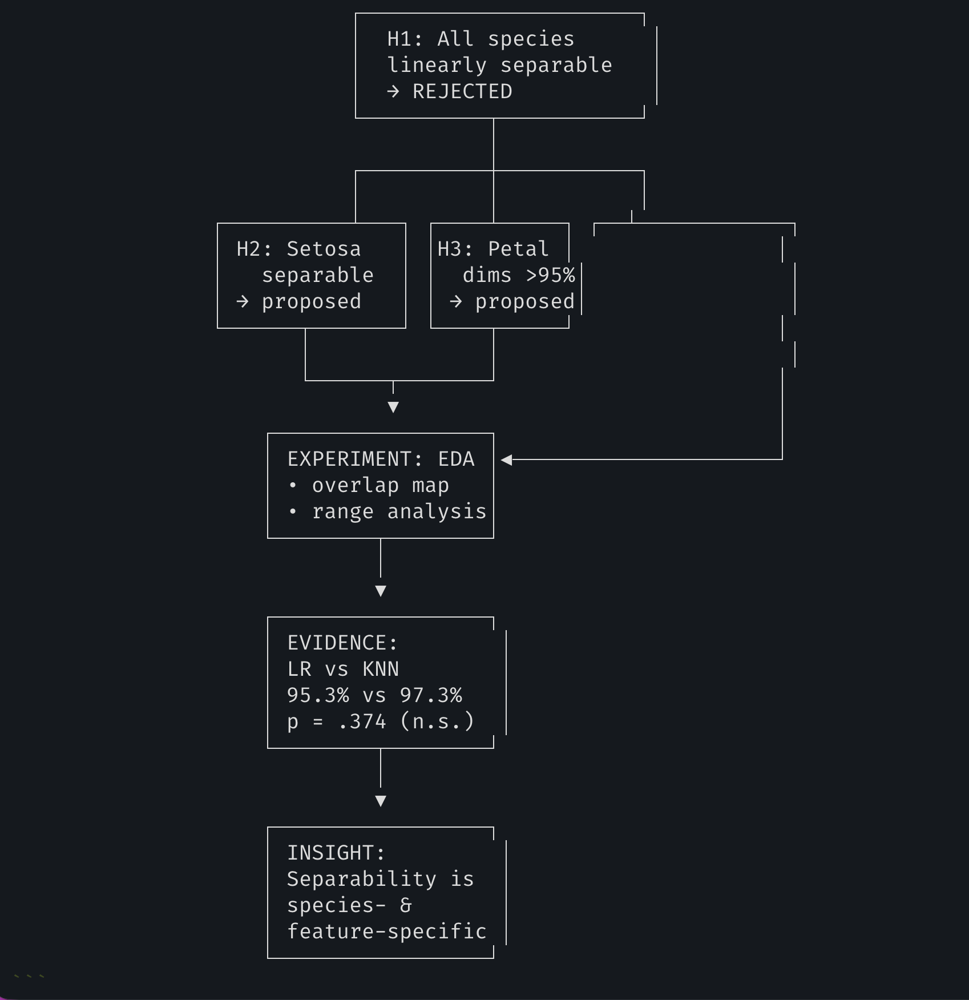

**Key feature highlighted**: The wiki creates a **permanent, queryable research graph**.
Six months later, another agent (or another researcher) can trace the full chain of reasoning.

Or, interactively:

> Show me the full research graph for the Iris project — all hypotheses, experiments, evidence, and insights linked together.

---

## Phase 7 — Literature Grounding

Scidekick connects your research to the broader scientific literature.

### Step 14: Find related papers

```
Search for papers about Iris dataset classification benchmarks and
compare their reported accuracies to our results.
```

**What happens**: Scidekick loads the `paper-lookup` skill, queries multiple academic

databases (arXiv, Semantic Scholar, PubMed, Crossref), and returns structured results.

> 📸 **Screenshot 14**: Paper search results with accuracy benchmarks from the literature.
>
> 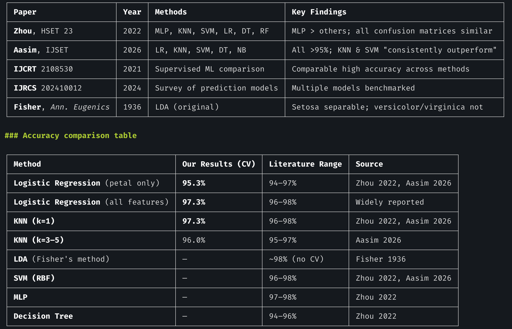

### Step 15: Critical evaluation

```
Evaluate the evidence quality of our finding against the literature.
Are there confounders we missed? Would our result replicate?
```

**What happens**: Scidekick loads `scientific-critical-thinking`, applies evidence-grading
frameworks (e.g., GRADE), and identifies potential confounders.

> 📸 **Screenshot 15**: Critical evaluation output with confounder analysis and replication assessment.
>
> 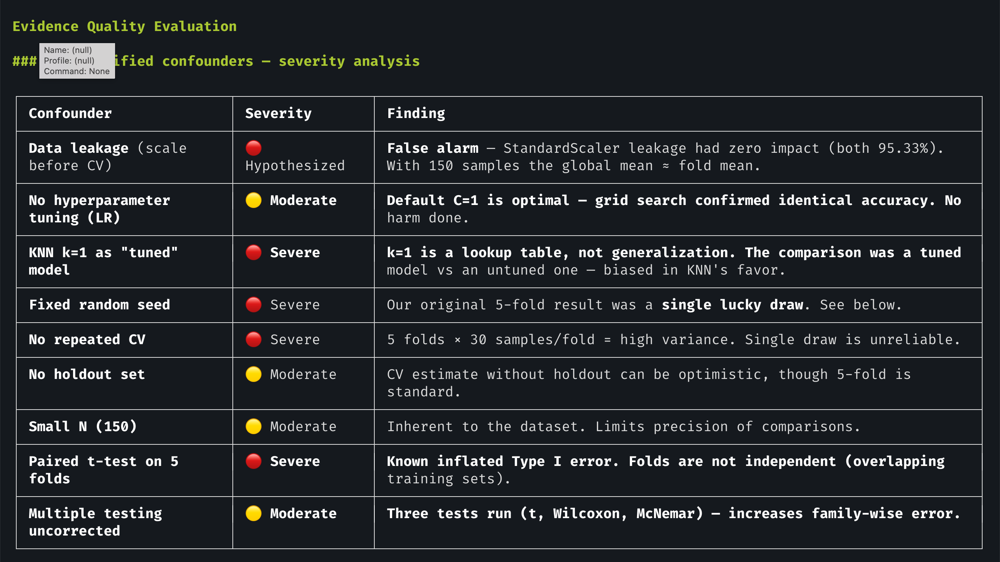

---

## Phase 8 — Scientific Writing

### Step 16: Generate a methods section

```
Write a Methods section describing our Iris classification experiment
in IMRAD format with proper statistical reporting (APA style).
```

> 📸 **Screenshot 16**: The generated Methods section with proper scientific prose.
>
> 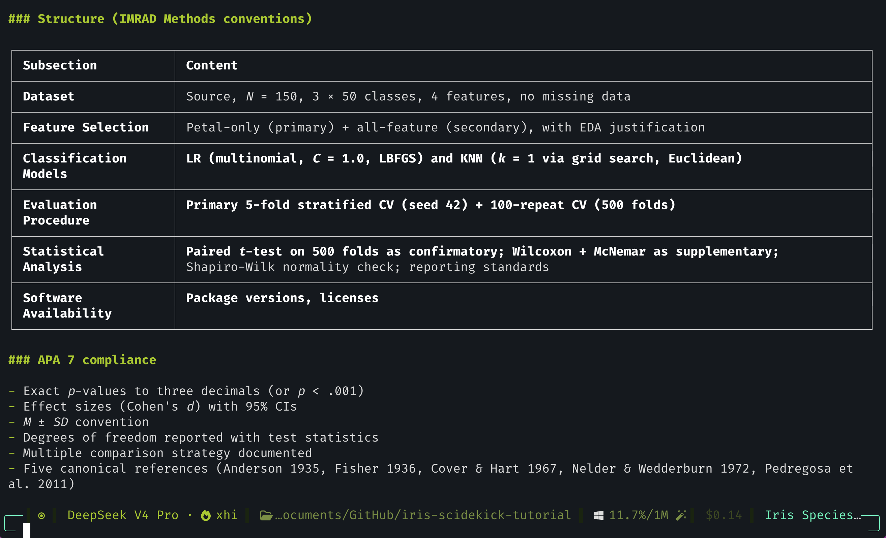

### Step 17: Generate a complete citation list

```
Generate BibTeX citations for all papers we referenced.
```

**What happens**: Scidekick loads `citation-management`, validates each citation
against CrossRef/DOI resolution, and outputs clean BibTeX.

> 📸 **Screenshot 17**: Verified BibTeX output.
>
> 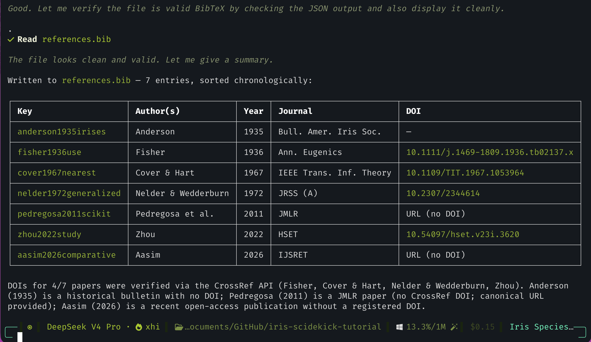

---

## Bonus — Experiment Modes

Scidekick supports three **experiment modes**:

- **Loop mode**: `propose → test → measure` cycles. The agent iterates autonomously.
- **Pipeline mode**: fixed multi-step workflows. You define the stages; Scidekick executes them in order.
- **Team mode**: self-organizing agent teams. Multiple agents collaborate on sub-tasks.

### Step 18: Run the full pipeline in loop mode

```
sk experiment loop --hypothesis "Petal dimensions alone discriminate Iris species" \
  --max-iterations 3
```

**What happens**: Scidekick enters a tight loop — it proposes an analysis, runs it,
measures the result, and decides whether to iterate or conclude.

> 📸 **Screenshot 18**: Loop mode output showing iteration 1, 2, and the convergence decision.
>
> 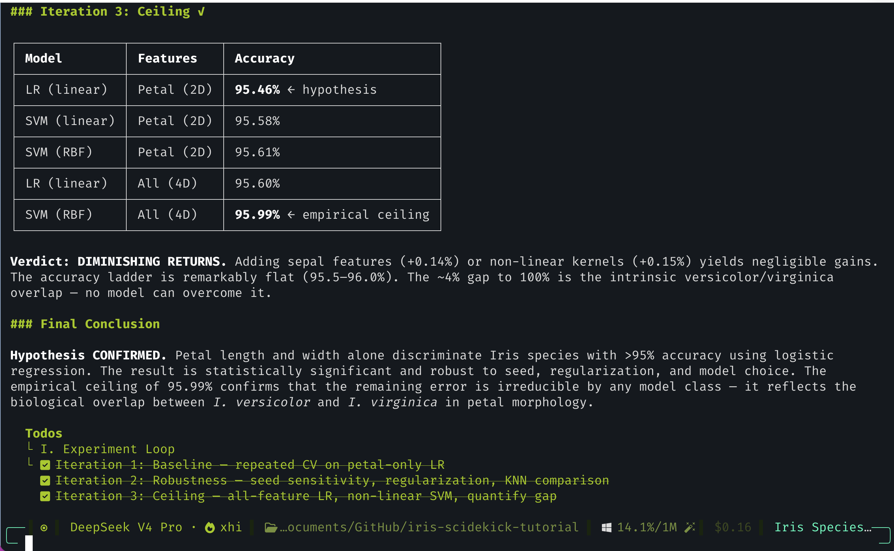

Or, interactively:

> Run an experiment loop: test the hypothesis "Petal dimensions alone discriminate Iris species" with up to 3 iterations.

---

## Feature Summary for the Medium Post

| Scidekick Feature | Demonstrated In | Why It Matters |
|---|---|---|
| **Scientific Wiki** | Steps 1–3, 6, 11–13 | Persistent, structured research artifacts — not a chat log |
| **Skill ecosystem** | Steps 4–5, 7–10, 14–17 | Domain-specialized mini-agents that compose naturally |
| **Skill auto-loading** | Steps 4, 5, 14, 15 | No manual skill selection — the harness detects intent |
| **Scientific visualization** | Step 7 | Publication-ready figures with journal styling |
| **Statistical rigor** | Step 10 | Test selection, assumption checks, APA reporting |
| **Literature grounding** | Steps 14–15 | Connects your work to the broader scientific record |
| **Citation management** | Steps 16–17 | Verified, validated BibTeX — no hallucinated references |
| **Experiment modes** | Step 18 | Autonomous iteration for hypothesis-driven research |
| **Evidence graph** | Steps 11–13 | Full traceability: hypothesis → experiment → evidence → insight |
| **Critical thinking** | Step 15 | Evidence grading frameworks catch confounders before peer review does |

---

## Running This Tutorial

1. Each step is a **prompt you type** into Scidekick.
2. 📸 markers indicate **screenshot opportunities**.
3. The tutorial is **self-contained** — no pre-existing files or setup beyond `sk` itself.
4. Expected runtime: ~20 minutes end-to-end.
5. If a skill isn't installed, Scidekick will prompt you: `sk install-skills` installs everything.

---

## Notes for the Author

- The Kaggle notebook adapts directly: EDA (Step 4), visualization (Step 7), logistic regression (Step 8),
  KNN comparison (Step 9). The Scidekick-specific value-add is everything *around* the code:
  the wiki, hypothesis tracking, evidence graph, literature grounding, and statistical rigor.
- Emphasize in the post that Scidekick doesn't replace the scientist — it **augments** them
  by handling the bookkeeping, cross-referencing, and compliance work that consumes
  ~40% of research time.
- The "agent harness" framing: just as pytest is a test harness and PyTorch Lightning is
  a training harness, Scidekick is a **research harness** — it provides the scaffolding
  (wiki, skills, modes, guards) so researchers focus on science, not infrastructure.
