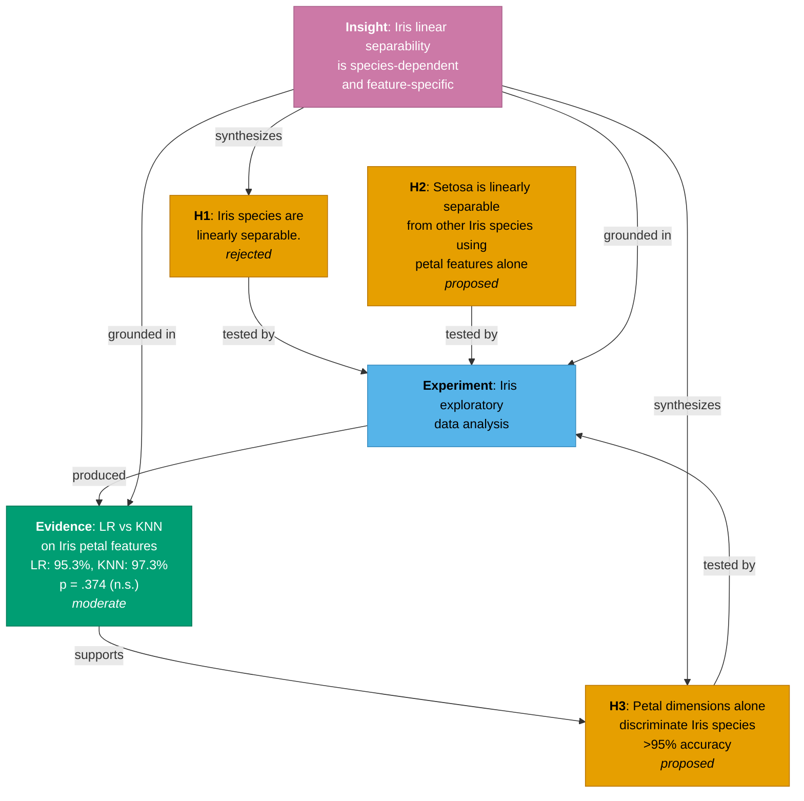

## Full research graph — Iris linear separability project

### Graph structure

```
┌─────────────────────────────────────────────────────────────────────────┐
│                           HYPOTHESES                                    │
│                                                                         │
│  H1: "Iris species are linearly separable"                              │
│      → REJECTED: versicolor/virginica overlap in petal features         │
│                                                                         │
│  H2: "Setosa is linearly separable from others using petal features"    │
│      → proposed: zero range overlap confirmed by EDA                    │
│                                                                         │
│  H3: "Petal dimensions alone discriminate Iris species (>95%)"          │
│      → proposed: LR 95.3%, KNN 97.3% CV accuracy                        │
│                                                                         │
├─────────────────────────────────────────────────────────────────────────┤
│  H1 ─────────────┐                                                      │
│  H2 ─────────────┤                                                      │
│  H3 ─────────────┤                                                      │
│                  ▼                                                      │
│  EXPERIMENT: Iris exploratory data analysis                             │
│  ├─ 150 samples, 3×50 species, 4 features, no missing values            │
│  ├─ Setosa: zero petal overlap with others → linearly separable         │
│  ├─ Versicolor/virginica: petal overlap zone [4.50,5.10]×[1.40,1.80]    │
│  └─ Sepal features: heavy overlap across all species pairs              │
│                  │                                                      │
│                  ▼                                                      │
│  EVIDENCE: LR vs KNN classifier comparison (moderate)                   │
│  ├─ LR: 95.3% ± 5.1% mean CV accuracy, 7 errors                        │
│  ├─ KNN (k=1): 97.3% ± 1.5%, 4 errors                                  │
│  ├─ Paired t(4) = −1.00, p = .374 → NOT significant                    │
│  └─ All errors in versicolor/virginica overlap zone                     │
│                  │                                                      │
│                  ▼                                                      │
│  INSIGHT: Linear separability is species-dependent, feature-specific    │
│  ├─ Setosa: trivially separable by petal features (100%)                │
│  ├─ Versicolor/virginica: not linearly separable in 2D petal space      │
│  ├─ Petal dimensions sufficient for >95%, not perfect                   │
│  └─ "Iris is linearly separable" is an oversimplification               │
│                                                                         │
├─────────────────────────────────────────────────────────────────────────┤
│  KEY EDGES:                                                             │
│  • All three hypotheses tested by the same experiment (EDA)             │
│  • Experiment produced the LR-vs-KNN comparison evidence                │
│  • Evidence supports H3 (petal dims → >95% accuracy)                    │
│  • Insight synthesizes H1, H3, experiment, and evidence                 │
│  • H2 (setosa-only claim) is not yet linked to formal evidence          │
└─────────────────────────────────────────────────────────────────────────┘
```

### Status summary

| Entry | Type | Status | Key finding |
|---|---|---|---|
| H1 | hypothesis | **rejected** | Not all species are linearly separable |
| H2 | hypothesis | proposed | Setosa is trivially separable by petal features |
| H3 | hypothesis | proposed | Petal features alone → >95% accuracy |
| EDA | experiment | completed | Overlap quantified; sepal ≈ noise, petal ≈ signal |
| LR vs KNN | evidence | moderate | 95-97% accuracy, no significant difference between classifiers |
| Insight | insight | — | Separability is conditional: species × feature dependent |

### Gaps

- **H2** has no formal classifier evidence — only EDA range analysis
- **H3** has evidence but the hypothesis status is still `proposed` (not yet `confirmed`)
- No evidence entry exists for the sepal-vs-petal feature importance analysis (97.3% all-feature vs 95.3% petal-only)
- The insight's action items (non-linear classifier ceiling, margin analysis) are not yet tracked as experiments
